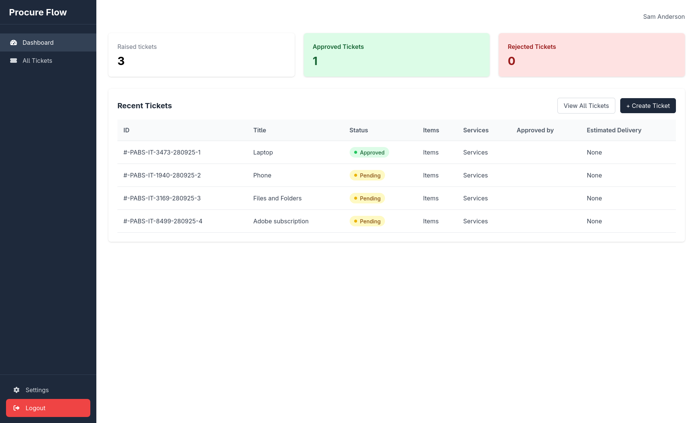
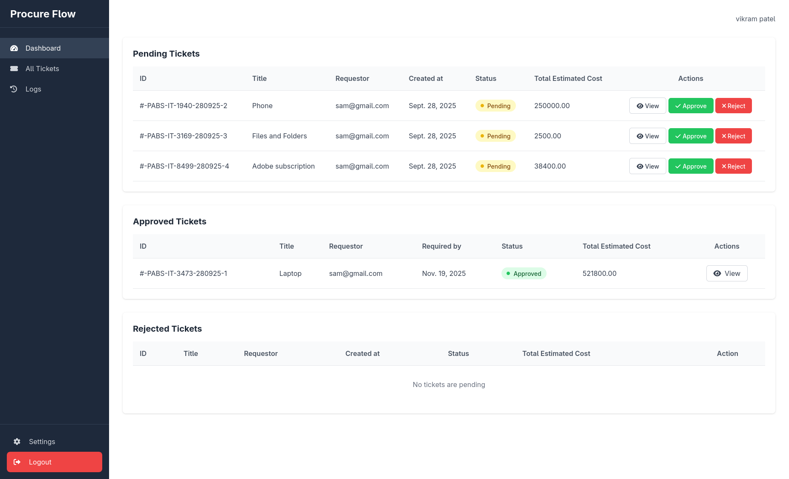
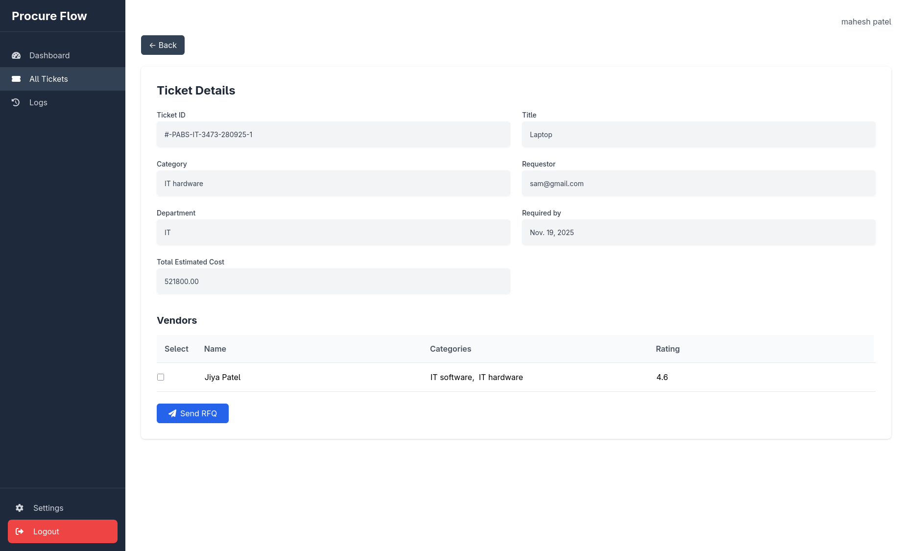
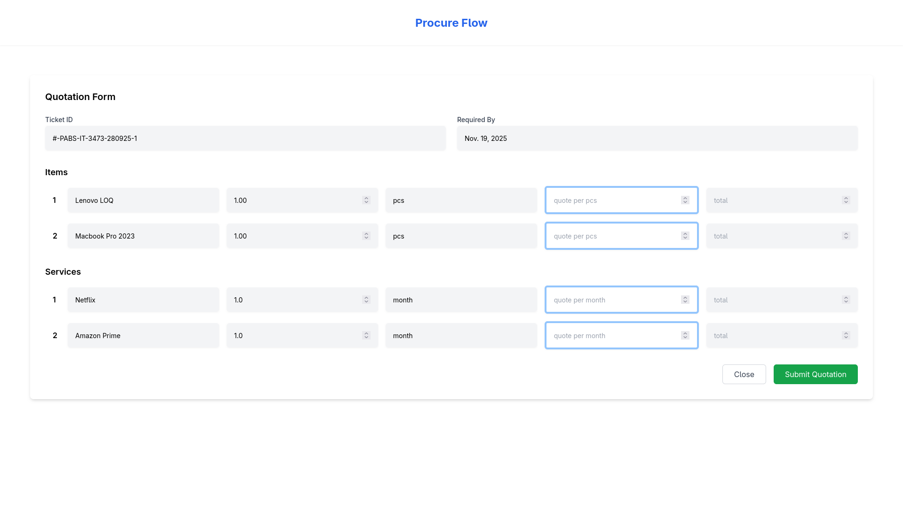

# ProcureFlow

**ProcureFlow** is a Django-based procurement management system that automates organizational purchasing workflows.  
It supports multiple companies and departments, role-based access, ticketed requisitions, HOD approvals, RFQ issuance by procurement, and a vendor quotation portal.

---

## Table of contents
- [Key features](#key-features)  
- [Tech stack](#tech-stack)  
- [System roles](#system-roles)  
- [Quick demo / screenshots](#quick-demo--screenshots)  
- [Getting started (local)](#getting-started-local)  
- [Deployment notes](#deployment-notes)  
- [Models & workflow (summary)](#models--workflow-summary)
- [Future improvements](#future-improvements)  
- [Contributing](#contributing)  
- [License](#license)
- [Security & privacy](#security--privacy)  


---

## Key features
- Role-based access control (Employee, HOD, Procurement Member, Vendor, Admin).  
- Multi-company & department support — one instance can handle multiple organizations.  
- Ticket-based requisition by employees (goods/services).  
- Approval workflow: HOD reviews and approves/rejects requests.  
- RFQ management: Procurement members select vendors from an internal vendor DB and send RFQs.  
- Vendor quotation portal: vendors receive a secure link to submit itemized quotations for individual items/services.  
- Basic quotation comparison and status tracking.  
- Admin interface for managing users, vendors, departments, and companies.

---

## Tech stack
- Backend: Python, Django  
- Frontend: HTML, Tailwind CSS, JavaScript (vanilla)  
- Database: SQLite for quick dev  
- Authentication: Django auth + role checks  

---

## System roles
- **Employee**: Raises procurement tickets with details and justification.  
- **HOD (Head of Department)**: Reviews and approves/rejects tickets from their department.  
- **Procurement Member**: Reviews and approves/rejects tickets from their department.  
- **Vendor**: Receives a secure link to submit quotations per item/service.  
- **Admin**: Manage roles, companies, departments, and master data.

---

## Quick demo / screenshots
-   
-   
-   
- 

---

## Getting started (local)

1. Clone:
```bash
git clone https://github.com/<your-username>/procureflow.git
cd procureflow
```

2. Create and activate the virtual environment:
```bash
python -m venv venv
# Linux / macOS
source venv/bin/activate
# Windows (PowerShell)
venv\Scripts\Activate.ps1
# Windows (cmd)
venv\Scripts\activate
```

3. Install dependencies:
```bash
pip install -r requirements.txt
```

4. Run migrations and create superuser:
```bash 
python manage.py migrate
python manage.py createsuperuser
```

5. Start development server:
```bash
python manage.py runserver
```

---

## Deployment notes

- Set DEBUG=False in production.
- Configure ALLOWED_HOSTS.
- Use Gunicorn + Nginx (or a platform like Railway/Heroku).
- Serve static files with whitenoise or S3 + CDN.
- Set up HTTPS (Let's Encrypt).
- Use environment variables for secrets.
- Enable logging and monitoring; schedule DB backups.

---

## Models & workflow (summary)

- Company, Department — organizational grouping.
- Custom User (Extended) — fields: company, department, role (EMPLOYEE, HOD, PROCUREMENT, VENDOR, ADMIN).
- Ticket / Requisition — created by Employee; fields: items (list), description, amount_estimate, status (PENDING, APPROVED, REJECTED, CANCELLED), timestamps.
- RFQ — created by Procurement Member for an approved ticket; includes selected vendors and RFQ items.
- VendorQuotation — vendor-submitted quote per RFQ item with price, delivery timeline, terms. Linked to RFQ and Ticket.
- AuditTrail / Logs — record actions: who performed state changes and when.
- Tokenized Vendor Link — secure short-lived token allowing vendor to access quote form without full user account.

Typical flow:

1. Employee raises Ticket.
2. Ticket goes to HOD for review.
3. If HOD approves, Procurement Member creates RFQ and selects vendors.
4. Vendors receive tokenized links and submit quotations.
5. Procurement reviews quotations, compares, and finalizes vendor.

---

## Future improvements

- Email & SMS notifications for approvals and RFQ invites.
- Quotation comparison dashboard with scoring factors (price, delivery, vendor rating).
- Multi-stage approvals (multi-HOD or finance approval).
- Role delegation / temporary proxies.
- Audit exports (CSV / PDF).
- Integration with ERP/accounting systems.
- Docker support & CI/CD pipeline.

--- 

## Security & privacy
- Do not commit `.env` or secret keys.  
- Use HTTPS in production.  
- Restrict vendor links with short expiry tokens.  
- Enforce role-based permissions strictly.  
- Sanitize and validate all vendor input.
